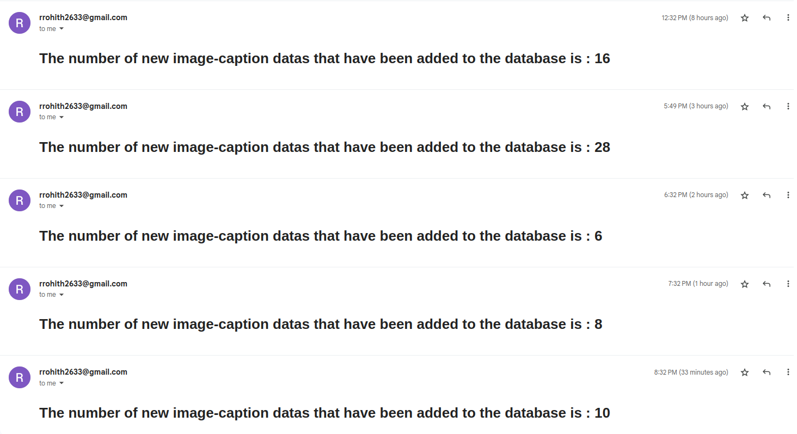
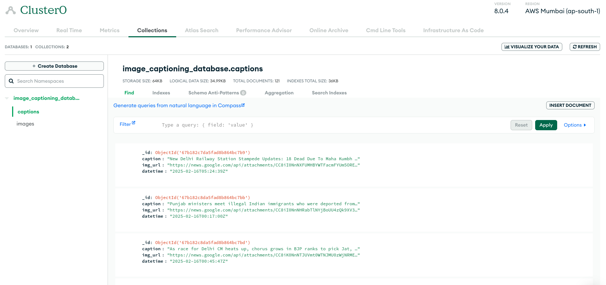

# **Important Notes**

To ensure smooth execution of the DAGs, follow these steps:

1. **Dependencies for _dag1.py_**  
   - Install required Python packages using the **_PIP_ADDITIONAL_REQUIREMENTS** variable in the `.yaml` file:  
     ```yaml
     PIP_ADDITIONAL_REQUIREMENTS: ${_PIP_ADDITIONAL_REQUIREMENTS:-selenium apache-airflow-providers-mongo}
     ```
   - _dag1.py_ requires **Selenium** for scraping lazy-loading pages and **MongoDB connectors** for Airflow integration.  
   - ⚠ **Note:** This method is for testing purposes only, as this is an assignment.

2. **Email Configuration in _dag2.py_**  
   - Update **Task 3** in _dag2.py_ with the following SMTP details under `op_kwargs`:  
     - `smtp-server`  
     - `smtp-port`  
     - `sender email` 
     - `password` 
     - `receiver email`  

3. **MongoDB Connection Setup**  
   - Ensure that MongoDB connections are properly configured in **Airflow** before running the DAGs.  

4. **Selenium Remote Chrome Driver Setup**  
   - Add the following service definition to your `.yaml` file to enable Selenium-based web scraping:  
     ```yaml
     services:
       selenium:
         container_name: remote_chromedriver
         image: seleniarm/standalone-chromium:latest
         ports:
           - 4444:4444
         restart: always
     ```
   - This sets up a **remote Chrome driver** accessible at port **4444** for web scraping tasks.  

5. **Email Result**
    - This screenshot shows the hourly email update of newly added data
    - 

6. **Database Result**
    - This screenshot shows the current status of my database (I have deleted and re-initiated this multiple times, which is the reason for less number of data points)
    - 